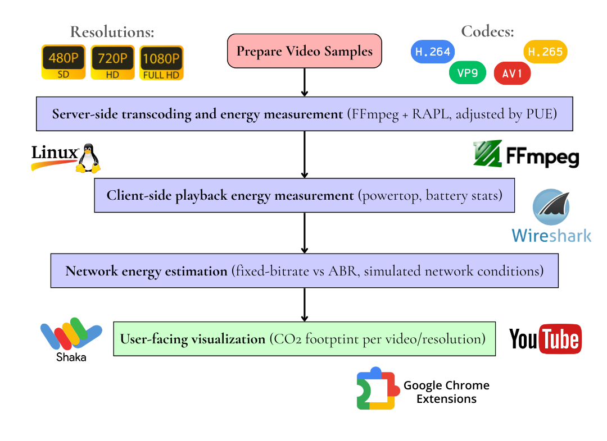

# E2E-StreamCarbon: An End-to-End Measurement Framework for Streaming Emissions



**See the carbon footprint of your YouTube streaming in real-time.**

This browser extension overlays estimated CO₂ emissions directly on YouTube videos, helping you understand the environmental impact of your streaming choices. No extra apps needed, works right where you watch.

### Features

- **Real-time CO₂ estimates** displayed on every YouTube video (live/streaming and on-demand).
- **Automatic resolution detection** (360p, 480p, 720p, 1080p, etc.)
- **Dual metrics**:
  - Total estimated CO₂ for the entire video (not useful when you are watching a live/streaming video because there is no duration)
  - Per-minute emissions rate
- **Intuitive color coding**:
  - 🟢 Green: Under 10g CO₂
  - 🟡 Yellow: 10-30g CO₂
  - 🔴 Red: Over 30g CO₂
 - **Visual water bottle equivalence:**
  - Shows a vertical bottle that fills proportionally to the estimated CO₂ emissions
  - Displays the equivalent liters of water consumed for streaming (data center + network usage)

### Installation

### For Chrome/Chromium-based browsers:

1. **Download the extension files** (clone this repo `git clone https://github.com/oteropaula/E2E-StreamCarbon` or download as ZIP)
2. The folder that you will need is the `stream_carbon` one
3. Open Chrome and go to: `chrome://extensions/`
4. Enable **Developer mode** (toggle in top-right corner)
5. Click **"Load unpacked"**
6. Select the folder (`stream_carbon`) containing the extension files

### Required files in the folder (make sure you have all of them):
```
manifest.json
content.js
popup.html
style.css
icon16.png, icon48.png, icon128.png
```

Once installed, you'll see the this icon in your browser toolbar:


### Using the extension
1. **Navigate to YouTube** and play any video
2. **Watch the overlay appear** with real-time CO₂ estimates
3. **Change video quality** to see emissions update instantly
4. **Click the extension icon** for more information

**Refresh the page** if you don't see the overlay

---

#### How it works

- **Emission factor**: 36 grams of CO₂ per GB of data streamed
- **Bitrate assumptions**: Based on standard streaming resolutions
- **Data sources**: Updated 2020 analysis from Carbon Brief and IEA

#### How we calculate
1. **Detect current resolution** by monitoring the actual video playback
2. **Map resolution to bitrate** using standard streaming values
3. **Calculate data usage** based on video duration
4. **Convert to CO₂** using 36g/GB emission factor

#### Smart detection
- Automatically updates when you change video quality
- Handles YouTube's single-page navigation
- Works with both regular videos and live streams
- Recovers from YouTube interface timing issues

#### Why it matters
- Global data centers consume massive amounts of energy
- Video streaming makes up over 60% of internet traffic
- Small choices add up: 30 minutes at 1080p ≈ 16g CO₂
- Lowering resolution can reduce emissions by 50-80%

#### Quick tips
- **480p** is usually sufficient for small screens
- **720p** offers a good balance of quality and impact
- **1080p** is best saved for important content
- **Auto-quality** often chooses higher than needed

#### Future improvements

- Support for Netflix, Twitch, and other platforms
- Personalized recommendations based on viewing habits
- Monthly impact summaries
- More precise regional emission factors
- Energy source awareness (renewable vs. fossil)

#### Contributing

Found a bug? Have an idea? We'd love your help!

1. Fork the repository
2. Create a feature branch (`git checkout -b feature/AmazingFeature`)
3. Commit your changes (`git commit -m 'Add some AmazingFeature'`)
4. Push to the branch (`git push origin feature/AmazingFeature`)
5. Open a Pull Request

---

**Remember**: Every gram counts! By being aware of your digital carbon footprint, you're already taking a step toward more sustainable streaming habits.
